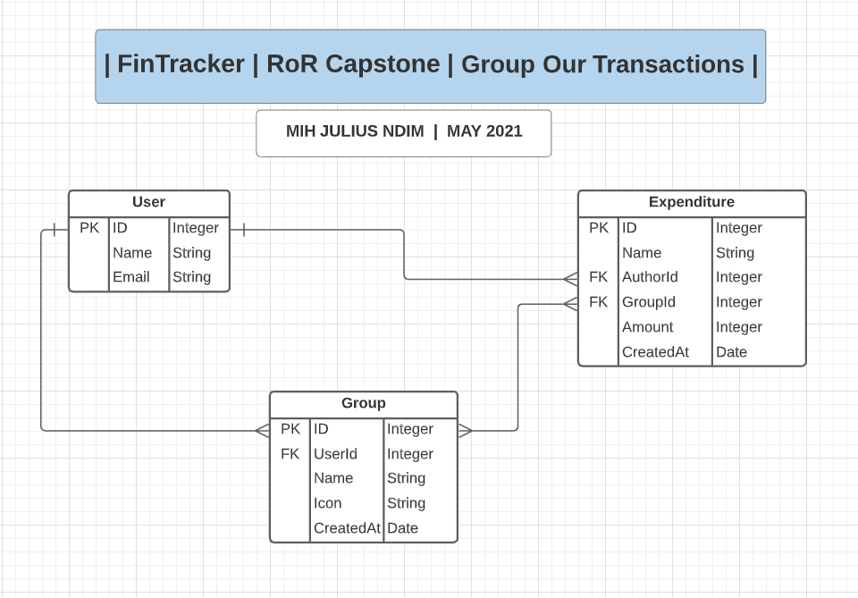
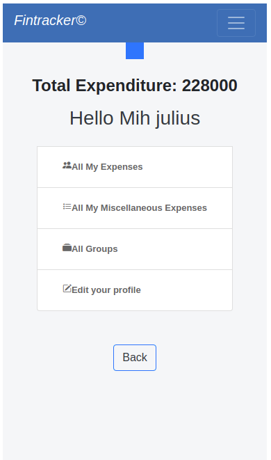
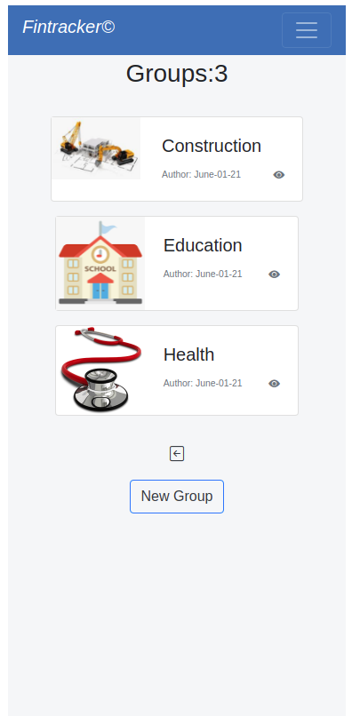
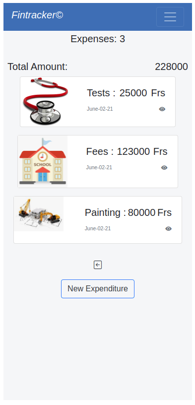
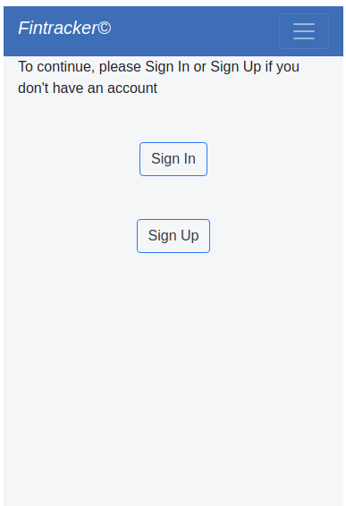

# README

# FinTracker-RoR-Capstone-Project
> In this project, I implemented an MVP(minimum viable product) with RoR, a mobile app called FinTracker to help track expenses. Here your expenses are grouped in different categories(groups) and the app helps you track what you have spent for the different categories.

## Built With

- HTML / SCSS / Ruby
- Bootstrap / Ruby on Rails 
- VS Code Editor / Ubuntu / Chrome Browser

## Features

- Create custom expenditure groups with their icons
- Calculate total amount spent 
- Track you expenses
- View expenses under different groups 
- Log in with just your username
- MVP for mobile users for now
- Upload group icon for you local hard drive for now. 

## Features still to be implemented

- Integration with cloud storage for persistent profile picture
- Filter expenses to display by day, week, month, or year.
- Display expenses as a bar compared with the set monthly budget
- Separate display of transactions for only logged in user 
- Implement the desktop version

## Live Demo

[Live Demo Link](https://livedemo.com)

## Getting Started

To get a local copy up and running follow these simple steps.

### Prerequisites

- Ruby: 3.0.0
- Rails: 6.1.3
- Chrome or Firefox Browser

### Setup
- Clone this repository with git clone git@github.com:Mihndim2020/FinTracker-RoR-Capstone-Project.git using your VS code terminal or your system command line
- Direct your terminal to the project folder by entering cd FinTracker-RoR-Capstone-Project
- Run bundle install to install the necessary dependencies
- Run rails db:setup to setup your local database.
- Run rails server to start the application.
- Finally, direct your browser to 'http://localhost:3000/' to view the app.

### Usage

### Run tests
To run tests open the terminal and cd to the project's root directory and run rspec

## Authors

👤 **Author1**

- GitHub: [@Mihndim2020](https://github.com/Mihndim2020)
- Twitter: [@mih julius](https://twitter.com/mih julius)
- LinkedIn: [mihndim](https://linkedin.com/in/mihndim)

## 🤝 Contributing

Contributions, issues, and feature requests are welcome!

Feel free to check the [issues page](../../issues/).

## Show your support

Give a ⭐️ if you like this project!

## Acknowledgments

- Microverse community
- Coding partner
- Gregoire Vella on Behance his design [design](https://www.behance.net/gallery/19759151/Snapscan-iOs-design-and-branding?tracking_source=) 
- The Odin Project

## 📝 License

This project is [MIT](./LICENSE) licensed.
